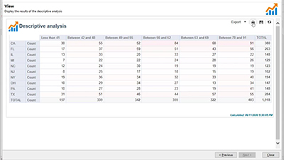

# Tutorials zur Client-Konsole von Adobe Campaign v8

Adobe Campaign bietet eine Plattform zur Konzeption kanalübergreifender Kundenerlebnisse und stellt dazu eine Umgebung für die visuelle Kampagnenorchestrierung, die Echtzeit-Interaktionsverwaltung und die Cross-Channel-Ausführung bereit. Dieses Benutzerhandbuch enthält Videos und Tutorials zu den zahlreichen Funktionen der Client-Konsole von Adobe Campaign v8.

Siehe

>[!INFO]
> Haben Sie Fragen? Möchten Sie Ihre Erfahrungen mitteilen oder Ihre Gedanken mit anderen austauschen? Oder haben Sie Feedback zum Lerninhalt für das Adobe-Team? Beteiligen Sie sich an der Diskussion im [Thread der Adobe Campaign-Lern-Community](https://experienceleaguecommunities.adobe.com:443/t5/adobe-campaign-classic/join-the-discussion-on-adobe-campaign-learning/td-p/419096)!
> 
> Diese Tutorials sind nicht das, was Sie suchen?
> Sehen Sie sich die [Tutorials für die Adobe Campaign Web-Benutzeroberfläche](https://experienceleague.adobe.com/docs/campaign-web-learn/tutorials/overview.html?lang=de) an, um Informationen zur Verwendung der Campaign Web-Benutzeroberfläche zu erhalten.

>[!NOTE]
> Campaign v8 ist derzeit nur als Managed Cloud Service verfügbar und kann nicht in On-Premise- oder Hybridumgebungen bereitgestellt werden. Die automatische Migration aus einer bestehenden Campaign Classic v7-Umgebung ist noch nicht verfügbar.
>
>Weitere Informationen zur Umstellung von Classic v7 auf v8 finden Sie in der [Produktdokumentation](https://experienceleague.adobe.com/docs/campaign/campaign-v8/new/v7-to-v8.html?lang=de).

## Mitarbeiterauswahl

<table>
<tr>
  <td>
    
    

      <a href="/help/get-started/create-a-marketing-plan-programs-and-campaigns.md">
    <strong>Erstellen eines Marketing-Plans</strong>
    </a>
    

    

    <em>Erfahren Sie, wie Sie Marketing-Plan, -Programm und -Kampagne erstellen.</em>
    

  </td>
   <td>
    
    

      <a href="./content-creation/create-and-design-email-deliveries.md">
    <strong>Erstellen und Entwerfen von E-Mail-Sendungen</strong>
    </a>
    

    

    <em>Machen Sie sich mit dem Erstellen eines E-Mail-Versands vertraut und erfahren Sie, wie Sie E-Mail-Inhalte gestalten und personalisieren.
</em>
    

  </td>
  <td>
    
    

      <a href="./send-messages/fatigue-management/typology-rules-for-fatigue-management.md">
    <strong>Verwalten von Ermüdung mit Typologieregeln</strong>
    </a>
    

    

    <em>Erfahren Sie, wie Sie die Ermüdungsverwaltung in Adobe Campaign mithilfe von Typologieregeln implementieren. </em>
    

  </td>
</tr>
<tr>
</td>
  <td>
    
    

      <a href="./reporting/generate-a-descriptive-analysis-report.md">
    <strong>Erstellen eines deskriptiven Analyseberichts</strong>
    </a>
    

    

    <em>Erfahren Sie, wie Sie anhand eines Workflows einen anschaulichen Analysebericht erstellen.</em>
    

  </td>
  <td>
   
     

      <a href="./data-management/data-management-fundamentals.md">
    <strong>Grundlagen des Daten-Managements mit Workflows</strong>
    </a>
    

    

    <em>Erfahren Sie, was Zielgruppendimensionen und Arbeitstabellen sind und wie Adobe Campaign Daten aus verschiedenen Datenquellen verwaltet.</em>
    

  </td>
  <td>
   
     

      <a href="./data-management/api-staging-mechanism.md">
    <strong>API-Staging-Mechanismus mit FFDA</strong>
    </a>
    

    

    <em>Erfahren Sie, wie der API-Staging-Mechanismus mit FFDA funktioniert.</em>
    

  </td>
</tr>
</table>

