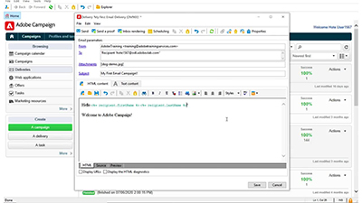

# Adobe Campaign V8 Tutorials - Überblick

Adobe Campaign bietet eine Plattform zum Entwerfen kanalübergreifender Kundenerlebnisse und bietet eine Umgebung für die visuelle Kampagnenorchestrierung, Interaktionsverwaltung in Echtzeit und die kanalübergreifende Ausführung. Dieses Benutzerhandbuch enthält Videos und Tutorials zu den zahlreichen Funktionen und Features von Adobe Campaign V8.

>[!NOTE]
> Campaign v8 ist derzeit nur als verwalteter Cloud Service verfügbar und kann nicht in On-Premise- oder Hybridumgebungen bereitgestellt werden. Die Migration aus einer bestehenden Campaign Classic v7-Umgebung ist noch nicht verfügbar.
>Weitere Informationen zu den Unterschieden zwischen den beiden Versionen finden Sie in der [Classic v7 bis V8-Produktdokumentation](https://experienceleague.adobe.com/docs/campaign/campaign-v8/start/capability-matrix.html) . Weitere Informationen zu Videos finden Sie im Abschnitt [Campaign Classic V7-Tutorials](https://experienceleague.adobe.com/docs/campaign-classic-learn/tutorials/overview.html?lang=de) .

## Neue Funktionen

[Wichtigste Funktionen](https://experienceleague.adobe.com/docs/campaign/campaign-v8/start/whats-new.html)

## Favoriten unserer Mitarbeiter

<table>
<tr>
  <td>
    
    

      <a href="./getting-started/create-a-marketing-plan-programs-and-campaigns.md">
    <strong>Marketingplan erstellen</strong>
    </a>
    

    

    <em>Erfahren Sie, wie Sie einen Marketingplan, ein Programm und eine Kampagne erstellen.</em>
    

  </td>
   <td>
    
    

      <a href="./content-creation/create-and-design-email-deliveries.md">
    <strong>Erstellen und Entwerfen von E-Mail-Sendungen</strong>
    </a>
    
 
    

    <em>Machen Sie sich mit dem Erstellen eines E-Mail-Versands vertraut und erfahren Sie, wie Sie E-Mail-Inhalte gestalten und personalisieren können.
</em>
    

  </td>
  <td>
    
    

      <a href="./send-messages/fatigue-management/typology-rules-for-fatigue-management.md">
    <strong>Ermüdung mithilfe von Typologieregeln verwalten</strong>
    </a>
    

    

    <em>Erfahren Sie, wie Sie mithilfe von Typologieregeln die Ermüdungsverwaltung in Adobe Campaign implementieren.  </em>
    

  </td>
</tr>
</table>

## Zusätzliche Ressourcen

* [Dokumentation](https://experienceleague.adobe.com/docs/campaign-v8.html)
