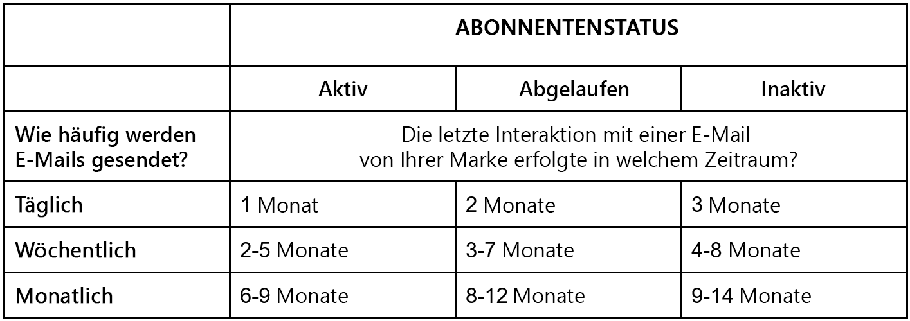

# E-Mail-ROI und Best Practices für die Rückgewinnung von Abonnenten

E-Mail-Marketing ist ein wertvolles Werkzeug zur Entwicklung der Markentreue und zur Steigerung des Umsatzes. Angesichts der großen Anzahl von E-Mails, die Menschen täglich erhalten - von den anderen digitalen Inhalten ganz zu schweigen, die sie konsumieren - ist es jedoch wichtig, dass sich Ihr Inhalt von der Menge abhebt. Und es ist wichtig, dass es den individuellen Bedürfnissen Ihrer Zielgruppe entspricht.

In diesem Artikel werden vier Strategien vorgestellt, um die Interaktion Ihrer Abonnenten und den Gesamterfolg Ihrer E-Mail-Kampagnen zu verbessern. Wir besprechen auch die Ermüdung von E-Mails, die Identifizierung innerhalb Ihrer Audiences und beschreiben einfache Schritte, die Sie zur Verbesserung Ihrer Abonnentenerfahrung unternehmen können.

## Was ist Zustellbarkeit?

Es kann zu Verwechslungen zwischen den Begriffen Versand und Zustellbarkeit kommen. Die Zustellbarkeit ist ein Maß für den Erfolg von E-Mail-Kampagnen. ob sie an den Posteingang des Abonnenten, den Junk-Ordner oder vom ISP blockiert werden. Wenn wir es als Gleichung betrachten würden, wäre es die Aktion, eine E-Mail zu senden, die Fähigkeit, im Posteingang zu landen, und die Fähigkeit, dies kontinuierlich zu tun.

Wie gut verfolgt Ihr Unternehmen die Zustellbarkeit Ihrer E-Mail-Kampagnen und wissen Sie, wo Ihre E-Mails enden?

## Spamfilterung

Bevor Sie sich mit der Strategie befassen, sollten Sie sich der häufigsten Probleme mit Spam-Filtern bewusst sein, die sich auf Ihre Kampagnenergebnisse auswirken könnten. Wenn Sie weiterhin E-Mails an inaktive Abonnenten senden, die Ihre E-Mails nicht öffnen, gibt es einige Dinge, mit denen Sie möglicherweise seit über einem Jahr konfrontiert sind:

* Blockierungslisten und Zulassungslisten
* Inhaltsfilter
* IP- und Domain-Reputation
* Authentifizierung
* Beschwerden
* Benutzeraktionen

## E-Mail-ROI maximieren

Wussten Sie, dass es in nur einer Minute im Internet über eine Million Videoansichten, zwei Millionen Google-Suchanfragen, sechs Millionen Facebook-Aufrufe und 200 Millionen E-Mails gibt? Da so viel passiert, ist es wichtig sicherzustellen, dass Ihr Inhalt nicht durch den Lärm verloren geht. Besonders wenn Sie während einer Urlaubszeit eine Kampagne erstellen, ist es noch schwieriger, Ihre E-Mails vor potenziellen und wiederkehrenden Kunden zu versenden.

Von November bis Anfang Januar nimmt das Volumen der gesendeten Marketing-E-Mails erheblich zu. Posteingangsanbieter (ISPs) werden wesentlich mehr Traffic auf ihre Server bringen als im Rest des Jahres und werden daher ihre Kunden (Ihre Abonnenten) noch wachsamer schützen.

Im Folgenden finden Sie vier Schlüsselstrategien zur Maximierung Ihres ROI:

### 1. Vorbereiten des Inhaltskalenders

* ISPs verfolgen Ihren durchschnittlichen Versand von einer IP-Adresse aus. Verteilen Sie daher die Menge so weit wie möglich, um zu vermeiden, dass eine rote Markierung erstellt und an Spam gesendet wird.
* Richten Sie Ihren Inhaltskalender im Voraus ein und bereiten Sie Ihre Inhaltsautoren auf eine Steigerung des Versandvolumens vor
* Überlegen Sie, wie Sie Ihre E-Mails planen und eine enorme Steigerung des Versandvolumens vermeiden. Betrachten Sie einige Taktiken, z. B.:
   * Senden einer Explosion nicht zur gleichen Zeit, sondern über einige Tage
   * Strategische Planung für Tageszeiten, in denen E-Mail-Überlastungen auftreten, z. B. 8-10 Uhr
   * Wenn Sie es nicht über Tage verteilen können, versuchen Sie es für Stunden

### 2. Infrastruktur

* Stellen Sie sicher, dass die E-Mail-Authentifizierung ordnungsgemäß eingerichtet ist, indem Sie einen Test mit Ihrer eigenen E-Mail durchführen
* Machen Sie sich mit der Bounce-Handhabung vertraut und überprüfen Sie die Leistung Ihrer ISPs.
   * Gibt es potenzielle Probleme oder Blöcke mit einem bestimmten ISP?
   * Erkennen Sie Ihre Probleme, bevor Sie mit dem Versand großer Mengen beginnen, um unangenehme Überraschungen und schlechte Kampagnenleistung zu vermeiden.

### 3. Daten

* Identifizieren Sie alle Akquisetechniken, insbesondere Ihre Anmeldeprozesse und die DSGVO.
* Seien Sie bei Ihren Abonnenten so transparent wie möglich, wenn Sie nach ihrer E-Mail-Adresse fragen:
   * Welche Inhalte werden gesendet (Newsletter, Promotions, Ereignisse)
   * Wie viele E-Mails werden gesendet (täglich, wöchentlich, monatlich)

* Senden Sie eine Begrüßungs-E-Mail an neue Abonnenten:
   * Mit Begrüßungs-E-Mails können Sie verhindern, dass Abonnenten von neuen Inhalten blind werden, und sich nicht abmelden oder als Spam markieren.
   * Willkommens-E-Mails sind auch ein guter Indikator für die Leistung. Wenn sie nicht erfolgreich bereitgestellt oder damit interagiert werden, wissen Sie, dass dies ein Zeichen für eine schlechte Leistung oder eine schlechte Datenerfassung ist.

### 4. E-Mail-Verwaltung

* Segmentieren Sie Ihre Abonnenten und überwachen Sie, wo sie sich im Lebenszyklus Ihrer Marke befinden.
* Verwenden Sie Strategien zur Personalisierung von Inhalten, um die Relevanz Ihrer E-Mails zu verbessern

## E-Mail-Interaktion steigern und E-Mail-Ermüdung beheben

E-Mail-Müdigkeit tritt auf, wenn Ihre Abonnenten keine E-Mail mehr erhalten. E-Mail-Müdigkeit kann aus verschiedenen Gründen auftreten. Vielleicht sind sie schon zu lange auf Ihrer Liste und haben es satt, von Ihnen zu hören, oder Ihr aktueller Inhalt ist nicht mehr relevant. Es liegt an Ihnen und Ihrem Team, zu bestimmen, welche Kunden E-Mail-Müdigkeit erleben und warum. Worauf sollten wir also achten?

Zu den zu überwachenden Schlüsselmetriken gehören:

* Niedrigere Öffnungsraten
* Niedrigere Klickraten
* Höhere Abmelderaten

Leider werden die meisten Abonnenten, die E-Mail-Müdigkeit erleben, es nicht einfach für Sie machen. Sie werden sich nicht selbst abmelden, eine eindeutige Kennzeichnung, dass sie mit Inhalt nicht zufrieden sind. Viele löschen einfach Ihre E-Mails oder ignorieren sie, sodass Sie immer noch Öffnungen von Abonnenten sehen können, die nicht interagiert haben. Das Fazit lautet: Wenn Sie nicht reagieren, wenn Ihre Abonnenten Gewohnheiten ändern, kann dies Ihrer AbsenderReputation schaden, was letztendlich Ihren Gesamterfolg beeinträchtigt.

In diesem Zusammenhang finden Sie einige Best Practices, mit denen Sie Ihre Abonnenten binden und vorhersagen können, welche Art von Inhalt sie erhalten möchten, um Abmeldungen und inaktive Zielgruppen zu vermeiden.

### 1. Erstellen einer Strategie für die E-Mail-Häufigkeit

Leider gibt es keine richtige Antwort, wie viele E-Mails pro Woche gesendet werden. Um die richtige Zahl zu finden, berücksichtigen Sie Folgendes:

* Wo befindet sich Ihr Kunde im Kundenlebenszyklus?
* Wie beschäftigt sie sich mit Ihren E-Mails?
   * E-Mail zum Abbruch eines Warenkorbs im Vergleich zum Newsletter
   * Reaktivierung von E-Mail vs. Verkaufsstart
   * Warenkorbabbruch-E-Mail im Vergleich zur neuen Produkteinführung
* Wie kann Ihr Kunde Inhalte von Ihrer Marke empfangen?
* Welches sind die saisonalen Präferenzen Ihres Kunden?

### 2. Den Status Ihrer Abonnenten identifizieren

Der Status Ihrer Abonnenten (aktiv, verfallen oder inaktiv) hängt davon ab, wie oft Sie ihnen Inhalte senden. Von dort aus können Sie bestimmen, wie engagiert sie sind.

Im Folgenden finden Sie eine einfache Tabelle, die Sie bei der Prüfung unterstützt:

Wenn Sie beispielsweise Kunden täglich per E-Mail senden, sollten sie innerhalb des letzten Monats mit einer dieser E-Mails interagiert haben, um als aktiv und interagiert zu gelten. Wenn Sie dagegen Kunden monatlich per E-Mail schicken und diese nicht innerhalb von 9-14 Monaten interagiert haben, können sie als inaktiv betrachtet werden.

Für veraltete und inaktive Benutzer sollten Sie sich das Datum ansehen, an dem sich der Benutzer angemeldet hat, um den Grad der Interaktion zu ermitteln. Haben sie sich beispielsweise am Tag eines Wettbewerbs oder einer anderen Marketing-Kampagne angemeldet? Haben sie sich von einem Website-Popup mit einem Rabattangebot angemeldet? Nachdem Sie Ihre veralteten und inaktiven Benutzer identifiziert haben, ist es wichtig, Ihre Strategie zu ändern, um ihre Zufriedenheit zu verbessern und sie wieder in einen aktiven Abonnenten umzuwandeln.

### 3. Umsetzung von Rückgewinnungsstrategien

Schlüsseln Sie diesen Prozess in zwei Schwerpunktbereiche auf: a) E-Mail-Versandmuster und b) kreativer Inhalt der E-Mails selbst. Im Folgenden werden die einzelnen Bereiche genauer beschrieben:

**Versandmuster und -pläne aktualisieren**

* **Langsam starten** - Es ist ein Marathon, kein Sprint. Es ist keine Lösung, die Sie an einem Tag implementieren können. Erwägen Sie, mit einem kleinen Prozentsatz Ihrer Zielgruppe, 4-5 % oder so zu beginnen und die Leistung sorgfältig zu überwachen.

* **Markenbekanntheit berücksichtigen** - Stellen Sie sicher, dass der E-Mail-Traffic zu inaktiven Segmenten keine Reputationsprobleme verursacht.

* **Automatisieren von Workflows** - Halten Sie Ihre Listen sauber und ordentlich.

* **Druckregeln** - Schließen Sie Abonnenten aus dem Rückgewinnungsprogramm vom Empfang anderer E-Mails aus.

**Kreativ und Inhalt**

* **Angebot einer klaren OPT-IN/OPT-OUT** - Machen Sie es den Benutzern einfach, schnell zu entscheiden, ob sie von Ihnen hören möchten. Sie können mit einem Opt-in belohnt werden, dass Sie zuerst auf ihre Bedürfnisse achten, anstatt sich auf die geschäftlichen Anforderungen für Interaktionen zu konzentrieren.

* **Erstellen eines Präferenzzentrums** - So können Sie Ihren Abonnenten zusätzliche Kontrolle erteilen, sodass sie aus unterschiedlichen E-Mail-Inhalten wie Newslettern, Werbeangeboten, Veranstaltungen usw. sowie aus unterschiedlichen Regelmäßigkeiten auswählen können. Denken Sie daran, wenn Sie sich dafür entscheiden, dies anzubieten, stellen Sie sicher, dass Sie Ihre Zielgruppe verfolgen und ordnungsgemäß segmentieren können, um diese Voreinstellungen zu erfüllen.

* **Starke Betreffzeilen** - Achten Sie darauf, dass sie sich von anderen Markeninhalten unterscheiden

* **Testen und Lernen** - Ein guter Testplan ist wichtig, um sicherzustellen, dass Ihre Bemühungen die gewünschte Wirkung zeigen. Erfahren Sie, was funktioniert und was nicht, und navigieren Sie entsprechend.

Eine Zusammenfassung dieses Artikels und eine Live-Demo zur Implementierung von Rückgewinnungsstrategien finden Sie in unserer [Webinar](https://adobecustomersuccess.adobeconnect.com/pm8goho13xuy/).

Erfahren Sie mehr über Strategie und Gedankenführung auf der [Kundenerfolg](https://experienceleague.corp.adobe.com/docs/customer-success/customer-success/overview.html) Hub.
